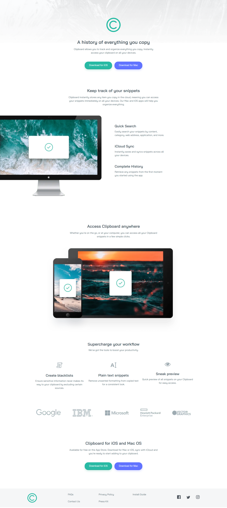

# Frontend Mentor - Clipboard landing page solution

This is a solution to the [Clipboard landing page challenge on Frontend Mentor](https://www.frontendmentor.io/challenges/clipboard-landing-page-5cc9bccd6c4c91111378ecb9). 

## Table of contents

- [Overview](#overview)
  - [The challenge](#the-challenge)
  - [Screenshot](#screenshot)
  - [Links](#links)
- [My process](#my-process)
  - [Built with](#built-with)
  - [What I learned](#what-i-learned)
  - [Continued development](#continued-development)
  - [Useful resources](#useful-resources)

## Overview

### The challenge

Users should be able to:

- View the optimal layout for the site depending on their device's screen size
- See hover states for all interactive elements on the page

### Screenshot

### Links

- Solution URL: [Frontend Mentor](https://www.frontendmentor.io/solutions/clipboard-landing-page-sTb_l9CvXh)
- Live Site URL: [Netlify](https://clipboard-page-illyaas4show.netlify.app/)

## My process

### Built with

- Semantic HTML5 markup
- CSS custom properties
- Flexbox
- Mobile-first workflow

### What I learned

My aim for the challenge was to see if I could successfully make a full web page with 100 performance score on google speed test as I want to add that to one of my qualities and skills to enhance my portfolio. I was able to acheive this but I haven't got 100 accross the board yet although it is a design fault I belive as the contrast of the text isn't enough so I might have to go against the design for that. I learnt a lot about compressing images, changing their file types and using the picture element to make images responsive and lightweight. I also learnt about preloading images for the landing section and lazyloading images for other images to increase page speed. I improved my flexbox skills to make responsive designs. It felt like the design on the challenge has mobile and desktop versions not match each other but I'm not sure.

### Continued development

I want to get better at optimising images as I seem to struggle a little with the google speed test complaining about width and height of images or something

### Useful resources

- [CodeStitch](https://codestitch.app/page-speed-handbook) - This helped me with getting 100 score on speed test.
